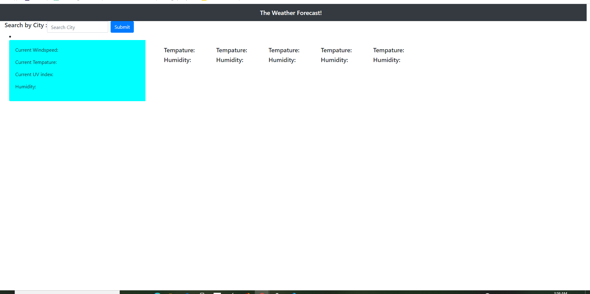

# My-WeatherdashBoard 
 While using this APP, the website will display the weather for the location that is searched. The The app also display the user search history and continue on with display . When a city is selected then, the following is presented : The tempature, the weather conditions, the wind speed, and the UV Index. The app will also display if the weather conditiions are moderate, or serve. 
 
# Installation 
Jquery 
API Open Weather 

# Resources
 [OpenWeather API](https://openweathermap.org/api)

# Link 
 https://ligaya96.github.io/my-weatherdashboard/

# Author 
Ligaya Herndon

## Screenshot
 